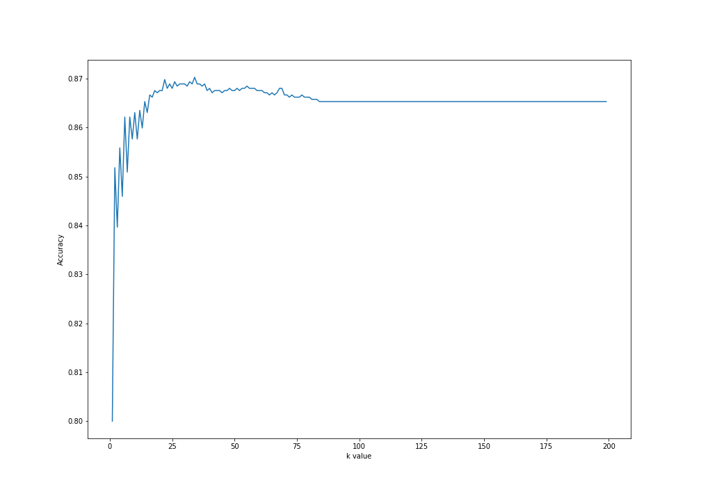

# Project: Twitter Classification Algorithms -- Part One

**Project description:** There's two parts of this project. 

In the first part, I wrote a system that predicts whether or not a tweet will go viral by using a K-Nearest Neighbor classifier. Some questions to answer:
1. What features of a tweet are the most important in determining its virality? 
2. Does the length of the tweet matter? 
3. What about the number of hashtags? 
4. Maybe information about the account that sent the tweet is most important. 

In the second part, I wrote a system that tests the power of Naive Bayes classifiers by predicting whether a tweet was sent from New York City, London, or Paris. Some questions to answer:
1. How is languaged used differently in these three cities?
2. Can the classifier automatically detect the difference between French and English? 
3. Can it learn local phrases or slang? 
4. Can I create tweets that trick the system?

The second part will be showcased on a different page to avoid cluttering.


# PART ONE: PREDICTING VIRAL TWEETS

## 1. Getting to know the data
Taking a look inside the data for the first time, we first have to import the essential packages before eventually printing the ```.head()``` of the DataFrame:
```python
import pandas as pd
import numpy as np
from matplotlib import pyplot as plt
from sklearn.preprocessing import scale
from sklearn.model_selection import train_test_split
from sklearn.neighbors import KNeighborsClassifier

all_tweets = pd.read_json("random_tweets.json", lines=True)
print(all_tweets.head(10))
```
Returns:
```
  created_at                   id               id_str  \
0 2018-07-31 13:34:40+00:00  1024287229525598210  1024287229525598208   
1 2018-07-31 13:34:40+00:00  1024287229512953856  1024287229512953856   
2 2018-07-31 13:34:40+00:00  1024287229504569344  1024287229504569344   
3 2018-07-31 13:34:40+00:00  1024287229496029190  1024287229496029184   
4 2018-07-31 13:34:40+00:00  1024287229492031490  1024287229492031488   
5 2018-07-31 13:34:40+00:00  1024287229491994625  1024287229491994624   
6 2018-07-31 13:34:40+00:00  1024287229454233605  1024287229454233600   
7 2018-07-31 13:34:40+00:00  1024287229445734400  1024287229445734400   
8 2018-07-31 13:34:40+00:00  1024287229441658880  1024287229441658880   
9 2018-07-31 13:34:40+00:00  1024287229424947201  1024287229424947200   

                                                text  truncated  \
0  RT @KWWLStormTrack7: We are more than a month ...      False   
1  @hail_ee23 Thanks love its just the feeling of...      False   
2  RT @TransMediaWatch: Pink News has more on the...      False   
3  RT @realDonaldTrump: One of the reasons we nee...      False   
4  RT @First5App: This hearing of His Word doesn’...      False   
5  RT @attackerman: This is torture: “The staff t...      False   
6  Did a demo of our Mobile Prototyping Kit at UX...       True   
7  RT @itstae13: Stop getting rid of your pets be...      False   
8  RT @RealErinCruz: Someone sent me a thought pr...      False   
9  RT @penis_hernandez: when you ask how a white ...      False   

                                            entities  \
0  {'hashtags': [], 'symbols': [], 'user_mentions...   
1  {'hashtags': [], 'symbols': [], 'user_mentions...   
2  {'hashtags': [], 'symbols': [], 'user_mentions...   
3  {'hashtags': [], 'symbols': [], 'user_mentions...   
4  {'hashtags': [], 'symbols': [], 'user_mentions...   
5  {'hashtags': [], 'symbols': [], 'user_mentions...   
6  {'hashtags': [], 'symbols': [], 'user_mentions...   
7  {'hashtags': [], 'symbols': [], 'user_mentions...   
8  {'hashtags': [], 'symbols': [], 'user_mentions...   
9  {'hashtags': [], 'symbols': [], 'user_mentions...   
```
... and a lot more columns. Since we don't have the luxury to manually gain every hidden insight when first touching the data, we can do so by entering:

```python
print("-------------------------")
#The length of the dataset (i.e. the number of tweets)
print(str(len(all_tweets)) + " tweets found in this dataset.")
print("-------------------------")
#The name of the columns
print(all_tweets.columns)
print("-------------------------")
#The first tweet in the dataset
print(all_tweets.loc[0]['text'])
print("-------------------------")
#The user (as a dictionary) from the first tweet in the dataset
print(all_tweets.loc[0]['user'])
print("-------------------------")
#The location from the first tweet in the dataset
print(all_tweets.loc[0]['user']['location'])
```
This prints the following useful information:
```
-------------------------
11099 tweets found in this dataset.
-------------------------
Index(['created_at', 'id', 'id_str', 'text', 'truncated', 'entities',
       'metadata', 'source', 'in_reply_to_status_id',
       'in_reply_to_status_id_str', 'in_reply_to_user_id',
       'in_reply_to_user_id_str', 'in_reply_to_screen_name', 'user', 'geo',
       'coordinates', 'place', 'contributors', 'retweeted_status',
       'is_quote_status', 'retweet_count', 'favorite_count', 'favorited',
       'retweeted', 'lang', 'possibly_sensitive', 'quoted_status_id',
       'quoted_status_id_str', 'extended_entities', 'quoted_status',
       'withheld_in_countries'],
      dtype='object')
-------------------------
RT @KWWLStormTrack7: We are more than a month into summer but the days are getting shorter. The sunrise is about 25 minutes later on July 3…
-------------------------
{'id': 145388018, 'id_str': '145388018', 'name': 'Derek Wolkenhauer', 'screen_name': 'derekw221', 'location': 'Waterloo, Iowa', 'description': '', 'url': None, 'entities': {'description': {'urls': []}}, 'protected': False, 'followers_count': 215, 'friends_count': 335, 'listed_count': 2, 'created_at': 'Tue May 18 21:30:10 +0000 2010', 'favourites_count': 3419, 'utc_offset': None, 'time_zone': None, 'geo_enabled': True, 'verified': False, 'statuses_count': 4475, 'lang': 'en', 'contributors_enabled': False, 'is_translator': False, 'is_translation_enabled': False, 'profile_background_color': '022330', 'profile_background_image_url': 'http://abs.twimg.com/images/themes/theme15/bg.png', 'profile_background_image_url_https': 'https://abs.twimg.com/images/themes/theme15/bg.png', 'profile_background_tile': False, 'profile_image_url': 'http://pbs.twimg.com/profile_images/995790590276243456/cgxRVviN_normal.jpg', 'profile_image_url_https': 'https://pbs.twimg.com/profile_images/995790590276243456/cgxRVviN_normal.jpg', 'profile_banner_url': 'https://pbs.twimg.com/profile_banners/145388018/1494937921', 'profile_link_color': '0084B4', 'profile_sidebar_border_color': 'A8C7F7', 'profile_sidebar_fill_color': 'C0DFEC', 'profile_text_color': '333333', 'profile_use_background_image': True, 'has_extended_profile': True, 'default_profile': False, 'default_profile_image': False, 'following': False, 'follow_request_sent': False, 'notifications': False, 'translator_type': 'none'}
-------------------------
Waterloo, Iowa
```

## 2. Defining viral Tweets (making labels)
A K-Nearest Neighbor classifier is a supervised machine learning algorithm, and as a result, we need to have a dataset with tagged labels. For this specific example, we need a dataset where every tweet is marked as viral or not viral. Unfortunately, this isn't a feature of our dataset — we'll need to make it ourselves.

For a tweet to be defined 'Viral', I would want to look at the number of retweets that tweet has. Let's create a new column called `is_viral` which returns 1 if the amount of retweets is high enough, and 0 otherwise. 

But how high is *high enough*? I would want to know the median amount of retweets among the 11099 tweets.

To make this entirely new feature, we enter the following:
```python
threshold_of_viral_RT = (all_tweets.retweet_count.median())
print(threshold_of_viral_RT)
```

Prints `13.0`.

```python
all_tweets['is_viral'] = np.where(all_tweets.retweet_count > threshold_of_viral_RT, 1, 0)
print(all_tweets.is_viral.value_counts())
```

Prints:
```
0    5562
1    5537
Name: is_viral, dtype: int64
```
From this, we can first conclude that there are 5537 'Viral' tweets according to my algorithm, and 5562 'non-Viral' tweets. Further calculation on my end proves that only **49% of the dataset is classified as 'Viral'**.
Thinking about this for a moment, it seems highly unlikely that almost half of these tweets are classified as Viral in real-life. Maybe I shouldn't have used median as the threshold, but use `mean()` instead:
```python
threshold_of_viral_RT = (all_tweets.retweet_count.mean().round()) ##prints 2778
all_tweets['is_viral'] = np.where(all_tweets.retweet_count > threshold_of_viral_RT, 1, 0)
print(all_tweets.is_viral.value_counts())
```

Prints:
```
0    9625
1    1474
Name: is_viral, dtype: int64
```
Which means that there are 1474 'Viral' tweets and 9625 'non-Viral' tweets. Further calculation proves that by implementing `mean()` instead of `median()` as the threshold maker, approximately **13% of the dataset is classified as 'Viral'**

`mean()` seems like a better model to use, so let's use the latter instead of the former.
```python
labels = all_tweets[['is_viral']].copy()
```

`labels` is now:
```
       is_viral
0             0
1             0
2             0
3             1
4             0
...         ...
11094         0
11095         1
11096         0
11097         0
11098         0

[11099 rows x 1 columns]
```

## 3. Making features
Now that we've created a label for every tweet in our dataset, we can begin thinking about which features might determine whether a tweet is viral. Here are some:
1. The tweet's length;
2. The user's followers;
3. The number of hashtags in that tweet;
4. The number of mentions in that tweet;
5. The amount of words in that tweet;

First, we make an extension to our `all_tweets` dataset to answer five of the features above:
```python

# 1. The tweet's length;
all_tweets['tweet_length'] = all_tweets.apply(lambda tweet: len(tweet['text']), axis=1)

# 2. The user's followers;
all_tweets['followers_count'] = all_tweets.apply(lambda tweet: tweet['user']['followers_count'], axis=1)

# 3. The number of hashtags in that tweet;
all_tweets['hashtag_count'] = all_tweets.apply(lambda tweet: tweet['text'].count('#'), axis=1)

# 4. The number of mentions in that tweet;
all_tweets['mention_count'] = all_tweets.apply(lambda tweet: tweet['text'].count('@'), axis=1)

# 5. The amount of words in that tweet;
all_tweets['word_count'] = all_tweets.apply(lambda tweet: len(tweet['text'].split()), axis=1)
```

After appending a new column to our existing DataFrame, I'm gonna build a new `features` DataFrame:
```python
features = all_tweets[['id', 'tweet_length', 'followers_count', 'hashtag_count', 'mention_count', 'word_count']].copy()
print(features.head())
```

Prints:
```
                    id  tweet_length  followers_count  hashtag_count  \
0  1024287229525598210           140              215              0   
1  1024287229512953856            77              199              0   
2  1024287229504569344           140              196              0   
3  1024287229496029190           140             3313              0   
4  1024287229492031490           140              125              0   

   mention_count  word_count  
0              1          26  
1              1          15  
2              1          22  
3              1          24  
4              1          24  
```
We will be using these five features for the rest of the project.

## 4. Normalizing the data
Recall that in step 1, we called:
`python from sklearn.preprocessing import scale`. We will use this `scale` command to normalize the data in our `features` dataset:

```python
scaled_features = scale(features, axis=0)
print(scaled_features)
```

Prints:
```
[[ 1.729237    0.6164054  -0.02878298 -0.32045057 -0.08781719  1.15105133]
 [ 1.72885717 -1.64577622 -0.02886246 -0.32045057 -0.08781719 -0.7854869 ]
 [ 1.72860529  0.6164054  -0.02887736 -0.32045057 -0.08781719  0.44685561]
 ...
 [-1.72738068  0.6164054  -0.02918038 -0.32045057  1.97282328 -0.25734011]
 [-1.72788455  0.6164054  -0.02955792 -0.32045057 -0.08781719  1.67919812]
 [-1.72788541 -1.71759151 -0.02208668 -0.32045057 -0.08781719 -1.13758476]]
```

## 5. Creating the training and test sets
Recall that in step 1, we called:
`python from sklearn.model_selection import train_test_split`. To evaluate the effectiveness of our classifier, we now split `scaled_features` and labels into a training set and test set using scikit-learn's `train_test_split` function:

```python
x_train, x_test, y_train, y_test = train_test_split(scaled_features, labels, train_size=0.8, test_size=0.2, random_state = 1)
```
This returns four kinds of data for our classifier machine:
1. The training data `x_train`
2. The testing data `x_test`
3. The training labels `y_train`
4. The testing labels `y_test`

## 6. Using the machine
Recall that in step 1, we called:
`python from sklearn.neighbors import KNeighborsClassifier`. I'm going to test our model by using `k` value iterated from 1 through 10. 
This can be done by first instantiating the classifier object:
```python
for x in range(1,11):
    classifier = KNeighborsClassifier(n_neighbors = x)
    classifier.fit(x_train, y_train)
    print(str(classifier.score(x_test, y_test)) + " with {0} as k.".format(x))
```

prints:
```
0.8 with 1 as k.
0.8518018018018018 with 2 as k.
0.8396396396396396 with 3 as k.
0.8558558558558559 with 4 as k.
0.845945945945946 with 5 as k.
0.8621621621621621 with 6 as k.
0.8509009009009009 with 7 as k.
0.8621621621621621 with 8 as k.
0.8576576576576577 with 9 as k.
0.863063063063063 with 10 as k.
```
We find that overall accuracy of our model reaches when **`k` is set to 10, which results in an approximately 86% accuracy**

If we were to test a larger amount of `k`, we can plot all instances of the object with the corresponding values with `matplotlib`:

```python
scores = []
for x in range(1,200):
    classifier = KNeighborsClassifier(n_neighbors = x)
    classifier.fit(x_train, y_train.values.ravel())
    scores.append(classifier.score(x_test, y_test))
plt.figure(figsize=(14,10))
plt.plot(range(1,200), scores)
plt.ylabel('Accuracy')
plt.xlabel('k value')
plt.savefig('1to200.png')
plt.show()
```
Prints:



# CONCLUSION

For our model with the features:
1. The tweet's length
2. The user's followers
3. The number of hashtags in that tweet
4. The number of mentions in that tweet
5. The amount of words in that tweet

And by iterating `k` from 1 through 100, we can see that the model performs best when `k` is around 25 and 40--with **approximately 87% accuracy**, before eventually falling into a flatline on `k` 85 onwards. 