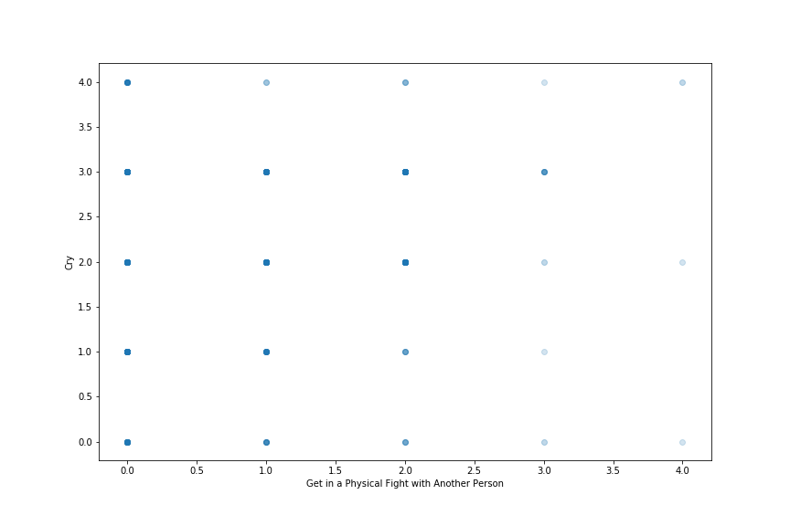
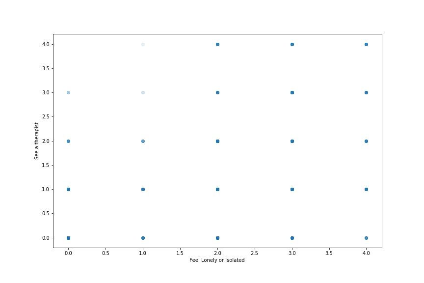

## Project: Using K-Means Clustering to Map Survey Responses

**Project description:** In this project, I used my knowledge of Unsupervised Machine Learning to gain insights based on the [FiveThirtyEight Survey](https://github.com/fivethirtyeight/data/tree/master/masculinity-survey) in which they asked 1600+ adult men regarding their masculinity. My goal was to obtain insights that weren't mentioned in their official release of the [survey on their website](https://fivethirtyeight.com/features/what-do-men-think-it-means-to-be-a-man/)

### 1. Getting to know the data
Before I began to code anything, I took a look at the survey questions asked at those 1600 men [(avaliable here)](/pdf/masculinity-survey.pdf). Some questions to answer:
1. What are the names of the columns? How do those columns relate to the questions in the PDF?
2. How many rows are there?
3. How is a question with multiple parts, like question 7, represented in the DataFrame?
4. How many people said they often ask a friend for professional advice? This is the first sub-question in question 7.
I printed the answers:
```python
import pandas as pd
survey = pd.read_csv("masculinity.csv")
print(survey.columns)
print("----------------------------")
print(len(survey))
print("----------------------------")
print(survey.q0007_0001.value_counts())
```
Prints:
```
Index(['Unnamed: 0', 'StartDate', 'EndDate', 'q0001', 'q0002', 'q0004_0001',
       'q0004_0002', 'q0004_0003', 'q0004_0004', 'q0004_0005', 'q0004_0006',
       'q0005', 'q0007_0001', 'q0007_0002', 'q0007_0003', 'q0007_0004',
       'q0007_0005', 'q0007_0006', 'q0007_0007', 'q0007_0008', 'q0007_0009',
       'q0007_0010', 'q0007_0011', 'q0008_0001', 'q0008_0002', 'q0008_0003',
       'q0008_0004', 'q0008_0005', 'q0008_0006', 'q0008_0007', 'q0008_0008',
       'q0008_0009', 'q0008_0010', 'q0008_0011', 'q0008_0012', 'q0009',
       'q0010_0001', 'q0010_0002', 'q0010_0003', 'q0010_0004', 'q0010_0005',
       'q0010_0006', 'q0010_0007', 'q0010_0008', 'q0011_0001', 'q0011_0002',
       'q0011_0003', 'q0011_0004', 'q0011_0005', 'q0012_0001', 'q0012_0002',
       'q0012_0003', 'q0012_0004', 'q0012_0005', 'q0012_0006', 'q0012_0007',
       'q0013', 'q0014', 'q0015', 'q0017', 'q0018', 'q0019_0001', 'q0019_0002',
       'q0019_0003', 'q0019_0004', 'q0019_0005', 'q0019_0006', 'q0019_0007',
       'q0020_0001', 'q0020_0002', 'q0020_0003', 'q0020_0004', 'q0020_0005',
       'q0020_0006', 'q0021_0001', 'q0021_0002', 'q0021_0003', 'q0021_0004',
       'q0022', 'q0024', 'q0025_0001', 'q0025_0002', 'q0025_0003', 'q0026',
       'q0028', 'q0029', 'q0030', 'q0034', 'q0035', 'q0036', 'race2',
       'racethn4', 'educ3', 'educ4', 'age3', 'kids', 'orientation', 'weight'],
      dtype='object')
----------------------------
1189
----------------------------
Sometimes                    537
Rarely                       324
Often                        142
Never, but open to it        123
Never, and not open to it     53
No answer                     10
Name: q0007_0001, dtype: int64
```
Thus, we can answer the questions:
- Each question in the pdf is represented by the first four digits after the 'q' character. 
- 1189 rows.
- Each multiple-part question in the pdf is represented by the last four digits after the '\_' character.
- (the table in the printed item)

### 2. Subsituting new values for easier plotting
I substituted strings like "Rarely" or "Often" to represent numbers, and done with multiple columns by iterating them. Since the results of Question 7 was not released on their website, iterating columns of question 7 might be a good idea to gain new insights:
```python
cols_to_map = ["q0007_0001", "q0007_0002", "q0007_0003", "q0007_0004",
       "q0007_0005", "q0007_0006", "q0007_0007", "q0007_0008", "q0007_0009",
       "q0007_0010", "q0007_0011"]
for x in cols_to_map:
    survey[x] = survey[x].map({
        "Often": 4,
        "Sometimes": 3,
        "Rarely": 2,
        "Never, but open to it": 1,
        "Never, and not open to it": 0
    })
    print(survey[x].head())
```
Prints the substituted values for each survey column (i.e. for each sub-question).

### 3. Plotting the substituted values
After we've reassigned the values, for example I want to see whether men who often cry also get in fights frequently--these are two completely contradictive actions yet we might find some hidden information if we were to graph those two aspects.
We can do this by:
```python
from matplotlib import pyplot as plt
plt.figure(figsize=(12,8))
plt.scatter(survey.q0007_0005, survey.q0007_0004, alpha=0.1)
plt.xlabel('Get in a Physical Fight with Another Person')
plt.ylabel('Cry')
plt.show()
```
Prints:


Or maybe, I want to know whether men who often feel lonely also see their therapists often. We can do this by:
```python
plt.figure(figsize=(12,8))
plt.scatter(survey.q0007_0011, survey.q0007_0010, alpha=0.1)
plt.xlabel('Feel Lonely or Isolated')
plt.ylabel('See a therapist')
plt.show()
```
Prints:


We can see that a large amount of men often feel lonely or isolated, but they chose not to see their therapists. 

### 4. Build the K-Means Model

I imported ```KMeans``` before dropping ```NaN``` values using ```dropna()```. Then, I instantiated KMeans object with two clusters. I later immediately fitted the object with the topic I want to cluster--in this case, the seventh question. From here, we can see the score of those two clusters' centers.
```python
from sklearn.cluster import KMeans
rows_to_cluster = survey.dropna(subset=["q0007_0001", "q0007_0002", "q0007_0003", "q0007_0004", "q0007_0005", "q0007_0006", "q0007_0007", "q0007_0008", "q0007_0009"])
classifier = KMeans(n_clusters = 2)
classifier.fit(rows_to_cluster[["q0007_0001", "q0007_0002", "q0007_0003", "q0007_0004", "q0007_0005", "q0007_0006", "q0007_0007", "q0007_0008", "q0007_0009"]])
print(classifier.cluster_centers_)
```
Prints:
```
[[1.89124668 1.85411141 0.85676393 1.72679045 0.55172414 2.67108753
  0.11671088 2.66843501 2.00265252]
 [2.85201794 2.81913303 2.85500747 2.39910314 0.70702541 2.86696562
  0.50373692 3.05082212 2.89387145]]
```
What does this mean? Remember that each row represents an action deemed masculine/feminine. Here is the full list:
1. Ask a friend for professional advice 
2. Ask a friend for personal advice 
3. Express physical affection to male friends, like hugging, rubbing shoulders 
4. Cry 
5. Get in a physical fight with another person 
6. Have sexual relations with women, including anything from kissing to sex 
7. Have sexual relations with men, including anything from kissing to sex 
8. Watch sports of any kind 
9. Work out See a therapist 
10. Feel lonely or isolated
Since a higher number means the person was more likely to "often" do something, the clusters seem to represent "people who do things" and "people who don't do things". In other words, people in cluster 2 were more likely to ask a professional advice rather than the ones in cluster 1--considering the first row's score for each cluster is ```1.89124668``` for cluster 1, and ```2.85201794``` for cluster 2.

### 5. Separate the Cluster Members

We might be able to find out more information about these clusters by looking at the specific members of each cluster. This is done by printing ```classifier.labels_``` shows which cluster every row in the DataFrame corresponds to.

Then, we can add the indices for every one's and zero's and call them ```cluster_one_indices``` and ```cluster_zero_indices```. This is done to see which person belongs to which cluster
```python
print(classifier.labels_)
cluster_zero_indices = []
cluster_one_indices = []
for x in range(len(classifier.labels_)):
    if classifier.labels_[x] == 0:
        cluster_zero_indices.append(x)
    elif classifier.labels_[x] == 1:
        cluster_one_indices.append(x)
print(cluster_zero_indices)
```
Prints classifier labels: 
```[1 0 1 ... 1 0 0]```
Prints indices of the people belonging to the first cluster:
```
[1, 4, 6, 7, 9, 10, 12, ..., 878, ..., 1045]
```
### 6. Investigate the Cluster Members
Now that we have the indices for each cluster, let's look at some stats about these two clusters. Remember in Step 4, we discovered that people in the second cluster were more likely to ask a professional advice rather than the ones in the first cluster.

We can get the rows of the DataFrame that correspond to clusters by doing the following:
```python
cluster_zero_df = rows_to_cluster.iloc[cluster_zero_indices]
cluster_one_df = rows_to_cluster.iloc[cluster_one_indices]
```
Then, for instance, we want to see whether education level impacts their judgment regarding our discovery in Step 4:
```python
print(cluster_zero_df.educ4.value_counts())
print("----------")
print(cluster_one_df.educ4.value_counts())
```
Prints:
```
Some college            116
College or more         112
Post graduate degree     94
High school or less      52
Name: educ4, dtype: int64
----------
Post graduate degree    246
College or more         220
Some college            155
High school or less      50
Name: educ4, dtype: int64
```
Judging by these numbers, **one of the reasons why people in the second cluster were more likely to ask a professional advice is that they have higher education in general.** Conversely, people in the first cluster with lower levels of education doesn't seek professional advice as often as their counterparts.


###### more insights are to be added at a later time :)